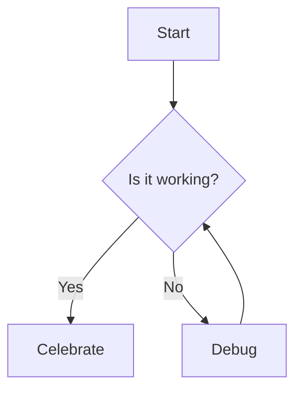
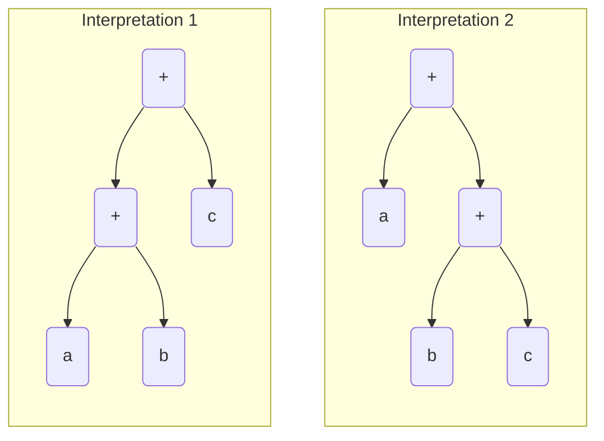

### Checking Math ($x$, $y$)

<!-- ## Checking Math -->

Here is some inline math: $x^2 + y^2 = z^2$.

$$
L_1 = \frac{1}{3} \rho v^2 S C_L
$$

This is an integral:

$$
\int\limits_\mathclap{-\infty}^\mathclap{\infty} \! e^{-x^2}\,\mathrm{d}x = \sqrt{2\pi}
$$

<!-- $$
\int\limits_{-\infty}^{\infty} \! e^{-x^2}\,\mathrm{d}x = \sqrt{2\pi}
$$ -->

This is the Binomial Theorem:

$$
(1 + x)^n = \sum\limits_{k\,=\,0}^n \binom{n}{k}x^k
$$

$$
(1 - x)^n = \sum\limits_{k\,=\,0}^n (-1)^k\binom{n}{k}x^k
$$

### Checking Mermaid

A mermaid diagram:



A more complex diagram:



### Checking gemoji

:+1:

### Checking Code

Basic code snippet:

```cpp
#include <iostream>

int main() {
  std::cout << "Hello World!\n";
}
```

With line numbers:

```js showLineNumbers=true
let a1
let a2
let a3
```

### Checking External Links

Let's check a link [like this](https://www.mathjax.org/).
