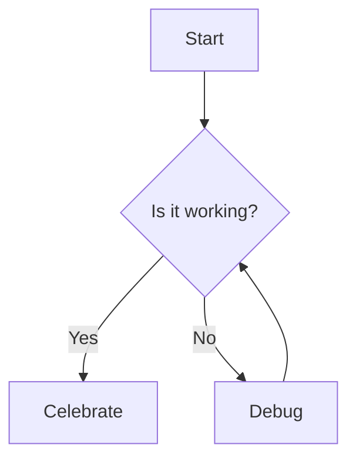

Here is some inline math: $x^2 + y^2 = z^2$.

$$
L = \frac{1}{2} \rho v^2 S C_L
$$

This is an integral:

$$
\displaystyle \int\limits_{-\infty}^{\infty} \! e^{-x^2}\,\mathrm{d}x = \sqrt{2\pi}
$$

A mermaid diagram:

